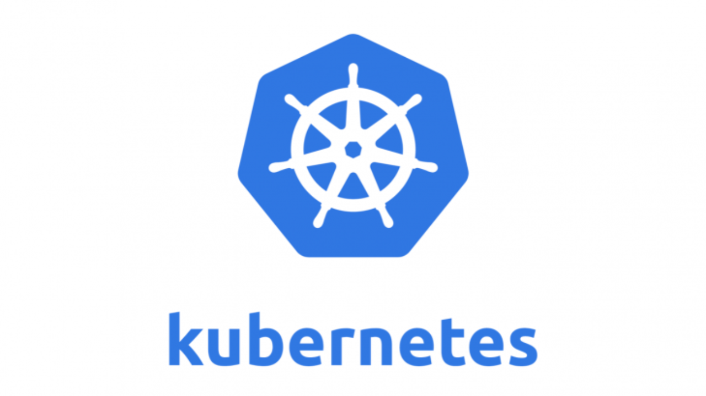

<br />
<p align="center">
  <a href="https://github.com/othneildrew/Best-README-Template">
    
  </a>

  <h3 align="center">Kubernetes Stack Config (Single Node Master)</h3>
</p>

##Stack 
* Docker
* K8S
* Dashboard
* Grafana
* Prometheus

### S.O
- CentOS 7.0 x64

### Installation Dependences

```sh
sudo yum clean all
sudo yum update -y
sudo yum groupinstall 'Development Tools'
sudo yum install wget
```

### Desabilitando SELINUX & Firewall
```sh
sudo setenforce 0
sudo sed -i --follow-symlinks 's/SELINUX=enforcing/SELINUX=disabled/g' /etc/sysconfig/selinux
sudo systemctl stop firewalld
sudo systemctl disable firewalld
```

### Desabilitando SWAP
```sh
sudo swapoff -a
```

### Installation Docker & Kubernetes

```sh
curl -fsSL https://get.docker.com | bash
sudo systemctl enable docker
sudo systemctl start docker
```


- Criar arquivo para o repositorio do CentOS para adicionar o repo do K8S
```txt

[kubernetes]
name=Kubernetes
baseurl=https://packages.cloud.google.com/yum/repos/kubernetes-el7-x86_64
enabled=1
gpgcheck=1
repo_gpgcheck=1
gpgkey=https://packages.cloud.google.com/yum/doc/yum-key.gpg https://packages.cloud.google.com/yum/doc/rpm-package-key.gpg
```

- Salvar o Conteúdo acima em :
```sh
vim /etc/yum.repos.d/kubernetes.repo
```

- Instalando K8S
```sh
sudo yum install -y kubelet kubeadm kubectl
sudo systemctl enable kubelet && sudo systemctl start kubelet
```

-Configurar alguns parâmetros de kernel no sysctl

Em vim /etc/sysctl.d/k8s.conf
```txt
net.bridge.bridge-nf-call-ip6tables = 1
net.bridge.bridge-nf-call-iptables = 1
```

- Iniciando K8S
```sh
sudo sysctl --system
sudo systemctl daemon-reload
sudo systemctl restart kubelet
```

- Iniciando o Master Node
```sh
kubeadm init --apiserver-advertise-address $(hostname -i)
```

- Terminando Configuração dando permissão ao usuario
```sh
mkdir -p $HOME/.kube
sudo cp -i /etc/kubernetes/admin.conf $HOME/.kube/config
sudo chown $(id -u):$(id -g) $HOME/.kube/config
```

- Instalando Pod Network
```sh
kubectl apply -f "https://cloud.weave.works/k8s/net?k8s-version=$(kubectl version | base64 | tr -d '\n')"
kubectl get pods -n kube-system
```


### Dashboard K8S
- Implantação do DASHBOARD K8S
```sh
kubectl apply -f https://raw.githubusercontent.com/kubernetes/dashboard/v2.0.0/aio/deploy/recommended.yaml
```

- Definindo do IP Externo para o serviço dashboard
```sh
kubectl patch svc -n kubernetes-dashboard kubernetes-dashboard -p '{"spec":{"externalIPs":["x.x.x.x"]}}'
```

- Criar usuário e dar permissão para o token gerenciar o DASHBOARD

```sh
cat <<EOF | kubectl apply -f -
apiVersion: v1
kind: ServiceAccount
metadata:
  name: admin-user
  namespace: kubernetes-dashboard
EOF
```

```sh
cat <<EOF | kubectl apply -f -
apiVersion: rbac.authorization.k8s.io/v1
kind: ClusterRoleBinding
metadata:
  name: admin-user
roleRef:
  apiGroup: rbac.authorization.k8s.io
  kind: ClusterRole
  name: cluster-admin
subjects:
- kind: ServiceAccount
  name: admin-user
  namespace: kubernetes-dashboard
EOF
```

- adquirir o token
```sh
kubectl -n kubernetes-dashboard describe secret $(kubectl -n kubernetes-dashboard get secret | grep admin-user | awk '{print $1}')
```

### Configuração Extra
- Permitir com o Master Node instale YAMLS nele.
```sh
kubectl taint nodes --all node-role.kubernetes.io/master-
```

### Instando Helm 3.0
- Download em https://helm.sh/
```sh
tar -zxvf helm-v3.0.0-linux-amd64.tar.gz
mv linux-amd64/helm /usr/local/bin/helm
```
### Instalando GRAFANA
```sh 
helm repo add grafana https://grafana.github.io/helm-charts
helm repo update
helm install grafana grafana/grafana --namespace=monitoring
kubectl patch svc grafana-svc -n monitoring  -p '{"spec":{"externalIPs":["x.x.x.x"]}}'
```

### Instalando PROMETHEUS
```sh 
helm repo add bitnami https://charts.bitnami.com/bitnami
helm repo update
helm install my-prom-release bitnami/prometheus-operator
kubectl patch svc prometheus-svc -n monitoring  -p '{"spec":{"externalIPs":["x.x.x.x"]}}'
```